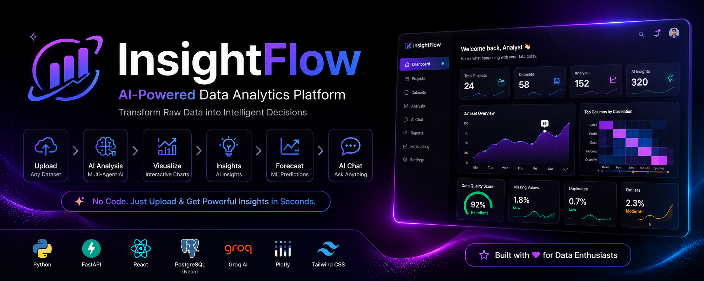
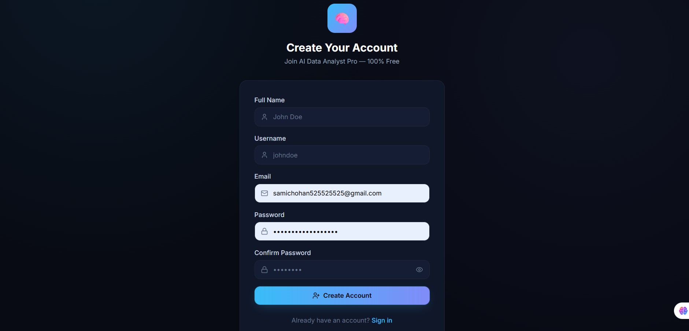
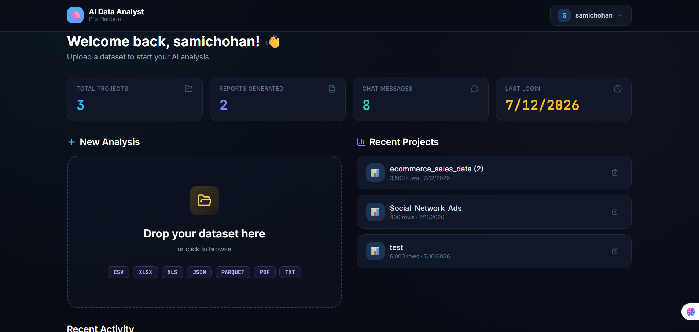
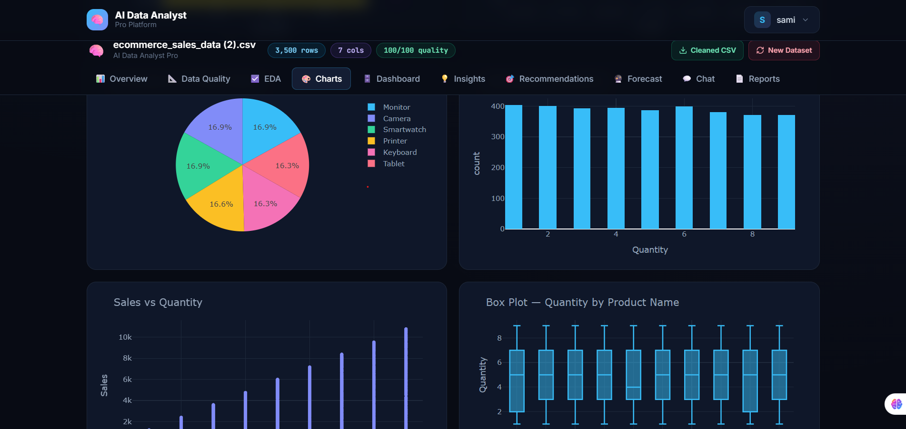

<div align="center">

# 🚀 InsightFlow

### AI-Powered Data Analytics SaaS Platform

Transform Raw Data into Intelligent Business Insights using Artificial Intelligence, Machine Learning, and Interactive Dashboards.

<br>



<br><br>

<a href="https://insight-flow-chi-smoky.vercel.app">

</a>

<a href="https://insightflow-production-6395.up.railway.app/docs">

</a>

<a href="https://insightflow-production-6395.up.railway.app">

</a>

<br><br>


</div>

---

# 📖 About InsightFlow

InsightFlow is a **Production-Level AI SaaS Platform** that enables users to analyze datasets without writing a single line of code.

Instead of manually cleaning data, creating charts, performing statistical analysis, or writing SQL queries, users simply upload a dataset and InsightFlow automatically performs the complete workflow using multiple AI-powered agents.

The platform combines:

- 🤖 Artificial Intelligence
- 📊 Data Analytics
- 📈 Machine Learning
- 📉 Business Intelligence
- ⚡ FastAPI
- ⚛ React
- 🐘 PostgreSQL
- ☁ Cloud Deployment

into a single production-ready application.

---

# ✨ Key Features

## 🔐 Authentication

- JWT Authentication
- User Registration
- Secure Login
- Password Hashing
- Protected API Routes

---

## 📂 Dataset Upload

Supports multiple file formats:

- CSV
- Excel (.xlsx)
- XLS
- JSON
- Parquet
- PDF
- TXT

---

## 📊 Automated Data Analysis

- Data Quality Detection
- Missing Values Detection
- Duplicate Detection
- Outlier Detection
- Statistical Summary
- Feature Detection
- Dataset Profiling

---

## 📈 Interactive Visualizations

- Bar Charts
- Line Charts
- Scatter Plots
- Pie Charts
- Histograms
- Heatmaps
- Correlation Matrix
- Dashboard Analytics

---

## 🤖 AI-Powered Features

- AI Business Insights
- AI Recommendations
- Smart Data Chat
- Forecasting
- Automated Report Generation
- Natural Language Queries

---

# 🌍 Live Deployment

| Service | URL |
|----------|-----|
| Frontend | https://insight-flow-chi-smoky.vercel.app |
| Backend API | https://insightflow-production-6395.up.railway.app |
| Swagger Docs | https://insightflow-production-6395.up.railway.app/docs |

---


# 🏗 System Architecture

```

                           USER

                             │

                             ▼

                  React Frontend (Vercel)

                             │

                 Axios REST API Requests

                             │

                             ▼

                 FastAPI Backend (Railway)

                             │

     ┌───────────────┬───────────────┬───────────────┐
     │               │               │               │
     ▼               ▼               ▼               ▼

 Authentication   AI Agents      PostgreSQL       File Storage
     (JWT)         Engine        (Neon Cloud)      (Uploads)

     │               │               │               │
     └───────────────┴───────────────┴───────────────┘
                             │
                             ▼

                 Analysis • Charts • Dashboard
               Insights • Forecast • Reports
                       Smart AI Chat

```

---

# 🔄 Complete Request Flow

```

User

│

▼

Login / Register

│

▼

JWT Authentication

│

▼

Upload Dataset

│

▼

Backend validates file

│

▼

Dataset stored

│

▼

AI Agents Execute

│

├── Data Cleaning

├── Quality Analysis

├── Exploratory Data Analysis

├── Visualization

├── Dashboard Generation

├── AI Insights

├── Recommendations

├── Forecasting

└── PDF Report

│

▼

Results stored in PostgreSQL

│

▼

Frontend receives response

│

▼

Interactive Dashboard

```

---

# 📂 Project Structure

```text
InsightFlow
│
├── backend/
│   │
│   ├── app/
│   │   │
│   │   ├── agents/
│   │   │   ├── data_cleaning_agent.py
│   │   │   ├── eda_agent.py
│   │   │   ├── visualization_agent.py
│   │   │   ├── dashboard_agent.py
│   │   │   ├── insight_agent.py
│   │   │   ├── recommendation_agent.py
│   │   │   ├── forecast_agent.py
│   │   │   ├── sql_agent.py
│   │   │   ├── pandas_agent.py
│   │   │   ├── report_agent.py
│   │   │   └── smart_chat_agent.py
│   │   │
│   │   ├── api/
│   │   │   ├── auth.py
│   │   │   ├── projects.py
│   │   │   ├── analysis.py
│   │   │   └── chat.py
│   │   │
│   │   ├── core/
│   │   │   ├── config.py
│   │   │   ├── auth.py
│   │   │   ├── llm_client.py
│   │   │   ├── logging_config.py
│   │   │   ├── exceptions.py
│   │   │   └── file_loader.py
│   │   │
│   │   ├── db/
│   │   │   └── database.py
│   │   │
│   │   ├── schemas/
│   │   │
│   │   ├── storage/
│   │   │   ├── uploads/
│   │   │   ├── charts/
│   │   │   └── reports/
│   │   │
│   │   └── main.py
│   │
│   ├── requirements.txt
│   └── runtime.txt
│
├── frontend/
│   │
│   ├── src/
│   │   ├── components/
│   │   ├── pages/
│   │   ├── hooks/
│   │   ├── context/
│   │   ├── lib/
│   │   ├── App.jsx
│   │   └── main.jsx
│   │
│   ├── package.json
│   ├── vite.config.js
│   └── vercel.json
│
├── assets/
│   └── banner.png
│
├── README.md
└── .gitignore
```

---

# 📦 Backend Folder Explanation

| Folder | Purpose |
|---------|----------|
| **agents/** | AI Agents responsible for data cleaning, EDA, visualization, forecasting, reporting and recommendations |
| **api/** | FastAPI REST API endpoints consumed by the React frontend |
| **core/** | Configuration, authentication, logging, exception handling and LLM integration |
| **db/** | SQLAlchemy models and PostgreSQL database connection |
| **schemas/** | Request and response validation using Pydantic |
| **storage/** | Stores uploaded datasets, generated charts and PDF reports |
| **main.py** | Main FastAPI application entry point |

---

# 🎨 Frontend Folder Explanation

| Folder | Purpose |
|---------|----------|
| **pages/** | Application screens |
| **components/** | Reusable UI components |
| **context/** | Authentication and global application state |
| **hooks/** | Custom React hooks |
| **lib/** | Axios API client and helper utilities |
| **App.jsx** | Main application routes |
| **main.jsx** | React application entry point |

---


# 🤖 AI Agent Architecture

InsightFlow follows a **multi-agent architecture** where each AI agent is responsible for a specific task in the analytics pipeline.

| AI Agent | Responsibility |
|----------|----------------|
| 🧹 Data Cleaning Agent | Handles missing values, duplicates and invalid records |
| 📊 EDA Agent | Performs Exploratory Data Analysis and descriptive statistics |
| 📈 Visualization Agent | Generates interactive charts and graphs |
| 📋 Dashboard Agent | Creates KPI cards and dashboard summaries |
| 💡 Insight Agent | Produces AI-powered business insights |
| 🎯 Recommendation Agent | Suggests actionable recommendations |
| 📉 Forecast Agent | Predicts future trends using machine learning |
| 🧠 Smart Chat Agent | Allows users to chat with their uploaded dataset |
| 📝 Report Agent | Generates professional PDF reports |

---

# 🛠 Tech Stack

## Frontend

- React 18
- Vite
- Axios
- React Router
- Plotly.js
- Framer Motion
- Lucide React

---

## Backend

- FastAPI
- SQLAlchemy
- Pydantic
- JWT Authentication
- Pandas
- NumPy
- Scikit-learn
- Uvicorn

---

## Artificial Intelligence

- Groq LLM
- PandasAI
- Machine Learning
- Forecasting Models

---

## Database

- PostgreSQL
- Neon Cloud Database

---

## Deployment

- Vercel (Frontend)
- Railway (Backend)

---

# 🗄 Database Architecture

InsightFlow stores all application data inside a **PostgreSQL database hosted on Neon**.

The database contains:

- User Accounts
- Authentication Information
- Uploaded Projects
- Dataset Metadata
- AI Generated Reports
- Chat History
- Activity Logs

Uploaded datasets are stored separately inside backend storage while metadata is stored inside PostgreSQL.

---

# ⚙ Environment Variables

## Backend (.env)

```env
DATABASE_URL=
SECRET_KEY=
ALGORITHM=HS256
ACCESS_TOKEN_EXPIRE_MINUTES=60
FRONTEND_URL=
GROQ_API_KEY=
```

---

## Frontend (.env)

```env
VITE_API_URL=
```

---

# 🚀 Local Installation

## Clone Repository

```bash
git clone https://github.com/samichohan/InsightFlow.git

cd InsightFlow
```

---

## Backend Setup

```bash
cd backend

python -m venv .venv

source .venv/bin/activate
```

Windows

```powershell
.venv\Scripts\activate
```

Install dependencies

```bash
pip install -r requirements.txt
```

Run backend

```bash
uvicorn app.main:app --reload
```

---

## Frontend Setup

```bash
cd frontend

npm install

npm run dev
```

---

# ☁ Production Deployment

| Service | Platform |
|----------|----------|
| Frontend | Vercel |
| Backend | Railway |
| Database | Neon PostgreSQL |

---

# 📸 Application Screenshots

> Add screenshots here.

```
assets/

login.png

dashboard.png

upload.png

charts.png

forecast.png

report.png
```

Example

```markdown
## Login



---

## Dashboard



---

## Charts


```

---

# 🔮 Future Improvements

- AI AutoML
- Team Collaboration
- Real-time Analytics
- Custom Dashboard Builder
- Scheduled Reports
- Multi-language Support
- Role-Based Access Control
- Data Versioning
- API Keys for Developers

---

# 👨‍💻 Author

**Sami Chohan**

AI & Data Science Developer

GitHub

https://github.com/samichohan

LinkedIn

(Add your LinkedIn profile)

---

# ⭐ Support

If you like this project, consider giving it a ⭐ on GitHub.

It really helps and motivates future development.

---

<div align="center">

### 🚀 Built with ❤️ using React, FastAPI, PostgreSQL and Artificial Intelligence.

</div>
